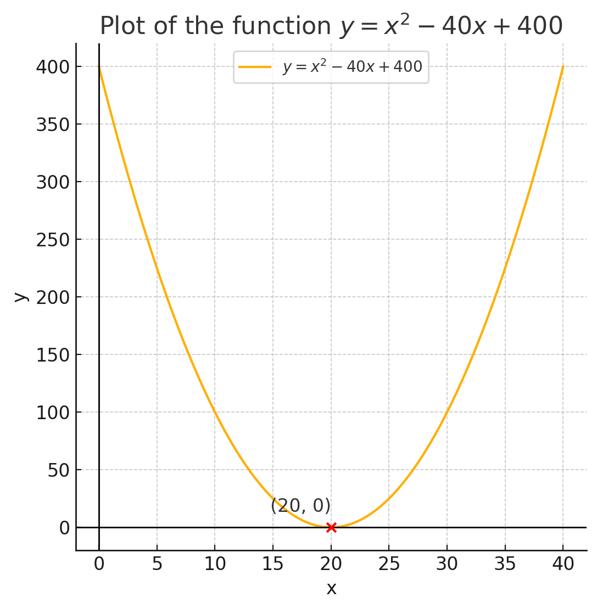

You probably heard the hype around Gradient Descent & how it's used to optimize *Deep Learning Models*. But you may never knew that it can be used to minimize **ANY** function you know.

In this blog post we're going to see how to use Gradient Descent to optimize a simple quadratic function <!-- more -->

we all know from highschool.
<div style="text-align: center;">

$ax^2 + bx + c$
</div>
with

```python
a = 1
b = -40
c = 400
```

we get the following formula
<br>
<div style="text-align: center;">
$x^2 - 40x + 400$

</div>
which can be written as
<div style="text-align: center;">
$(x - 20)^2$
</div>
<br>

Plotting this function will give us this curve:
.

From the above figure, we can see that this function achieves minimum at `x = 20`. since $(20 - 20)^2 = 0$


But suppose this function is a high dimensional function that we can't simply figure out the minimum, these kind of problems requires some algorithm to find (at least try) to achieve this minimum. Here comes gradient descent!

### Gradient Descent
What Gradient Descent does is the following:
1. Start at a random value.
2. Calculates the derivative ( slope ) of the function at this point.
3. Descent in the opposite direction.
4. Repeat 1->3 until convergence ( slope ~ 0 )

Suppose the formula
$(x - 20)^2$

is our cost function in a machine learning problem that we're trying to minimize.

#### Implementation
We start by importing the needed libraries, which are `numpy` & `tensorflow`
```python
import numpy as np
import tensorflow as tf
```

then we start tensorflow Interactive Session.
```python
sess = tf.InteractiveSession()
```

We are trying to find a value for the parameters X that will minimize the cost function, so let's declare this parameter and initialize it to 0
```python
X = tf.Variable([0],dtype= tf.float32)
```

The function we are trying to minimize is Y written as $Y = X^2 - 40X + 400$
So let's write it too
```python
Y = (X**2) - 40*X + 400
```
We are going to use Tensorflow's implementation of Gradient Descent with a *learning rate* of 0.01
>**Learning Rate**: We are not going to discuss it here, but think about it as the magnitude of our optimization. How ***steep*** is the optimizer going to descent down to the minimum at each iteration.


```python
train = tf.train.GradientDescentOptimizer(learning_rate=0.01).minimize(Y)
```

In Tensorflow, variables are not initialized unless you explicitly do that
```python
init = tf.global_variables_initializer()
sess.run(init)
```

Now for the training part, we're going to run the optimizer 1000 times to try to get to our minimum
```python
number_of_iterations = 1000    
for i in range(number_of_iterations):
    sess.run(train)
```
Finally after our training is complete, let's see what the optimizer found a value for X to minimize Y
```python
print(X.eval())
```

we get ` 19.99995422` which is approximately 20!