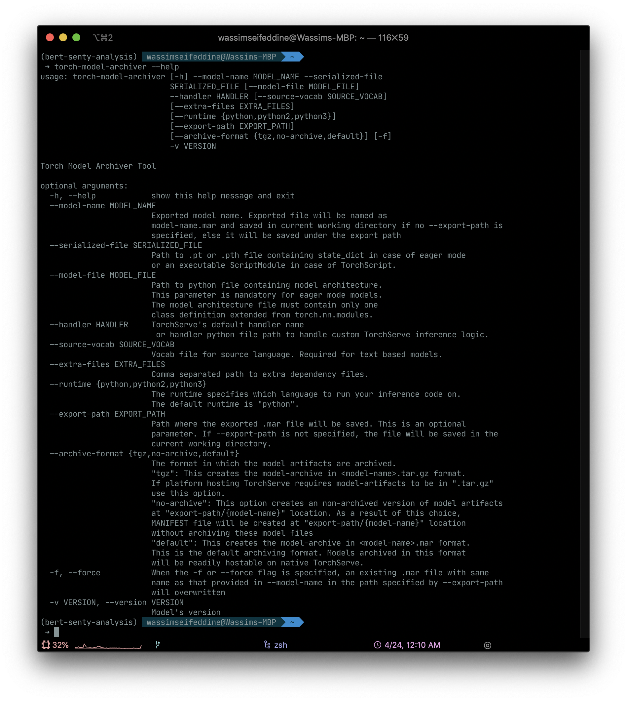

## Finally
So finally Pytorch is getting a decent (?) production serving capabilities. [TorchServe](https://github.com/pytorch/serve) was introduced a [couple of days ago](https://medium.com/pytorch/torchserve-and-torchelastic-for-kubernetes-new-pytorch-libraries-for-serving-and-training-models-2efd12e09adc) along with other interesting things

<!-- more -->

<div class="tip">
    I'm not in ANY way expert on putting pytorch in production environment. What I've been using is Flask. I have never tried ONNX or torchscript before to judge on.
</div>

So TorchServce was announced as a "industrial-grade path to deploying PyTorch models for inference at scale". In this tutorial we will try to load a finetuned BERT model.  


### Installing the requirements

2 things you need to get going is the torchserve and torch-model-archiver

```shell
 pip install torchserve torch-model-archiver
```

### Converting the model to MAR file

Before serving the model, you need to convert it to .mar file, for this step we are going to use the `torch-model-archiver` we just installed



Some parameter you should pay attention to are 

- __model-name__ : A name you want to specify to the model
- __serialized-file__: the model trained weights file
- __model-file__: the actual model definition file 
- __handler__: Will cover it in the next section 
- __extra-files__: Any extra files you can to add to your serving. will see how it's useful 
 
A sample command would be something like this 

```
torch-model-archiver --model-name my-model-name --version 1.0 \
--model-file model.py  --serialized-file ./model.bin \
--extra-files params.py --handler MyCustomHandler.py
```
The `--extra-files` should include every file that you are using in model.py. In my case they where the hyperparameter of my model

<div class="tip">
    Please make sure that you saved the model on the appropriate device. If you trained the model on GPU & trying to serve it on the server without GPU then the next step would fail
</div>

The output of this command would be a single my-model-name.mar file