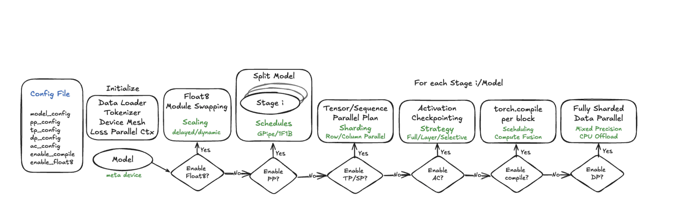
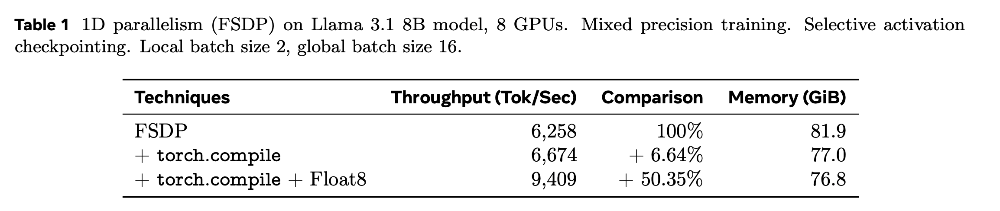

Torchtitan is an excellent project to learn how to implement distributed training techniques for training massive language models on **hundreds** of GPUs. I’ve been using it for a few months, and now that the [paper](https://arxiv.org/abs/2410.06511) is out, I thought it’d be a good idea to share a few posts about how to use it, what works and what doesn’t, what I learned while implementing these ideas in my own project.

---

This post will be an overview of the distributed training techniques implemented in Torchtitan and why they are important.
In the next couple of posts, I will be writing about my experience implementing each technique in my own project and what I learned from it and how much it actually helped.
## 1. Introduction

Torchtitan is a project from pytorch's team, it's their attempt to consolidate all the parallelism and distributed training techniques available in Pytorch into a single _framework_ that can be used to train large models on hundreds of GPUs and they did an **excellent** job at it. 

The techniques implemented in Torchtitan are modular, easy to understand and use, and they are all built on top of mostly vanilla Pytorch.

I use it more as a learning tool, to understand how to implement parallelism techniques in Pytorch, and to see how the Pytorch team is thinking about scaling deep learning models.

---

## 2. Why is This Important?

Torchtitan simplifies a few things that were missing or hard to do _correctly_ in PyTorch:

1. A unified, central resource for all parallelism techniques (implemented by the PyTorch team).
2. Faster experimentation thanks to a clean, modular design.
3. Consolidation or improvement of a few libraries:
   - **Pippy** -> `torch.distributed.pipelining`
   - **FSDP1** -> **FSDP2**
   - **FlatParameter** -> `DTensor`

---

## 3. Scaling Techniques in Torchtitan

Torchtitan’s techniques are very modular. Think of them like building blocks you can add or remove from your sharding strategy. The full pipeline looks like this:

<figure>
  
  <figcaption>Image from the <a href="https://arxiv.org/pdf/2410.06511">Torchtitan paper</a></figcaption>
</figure>

This design makes it easier to experiment without too much code refactoring.

### Meta Initialization
This is the simplest technique. It initializes the model on an _empty_ device, so the weights aren’t materialized until you apply the full sharding strategy. Saves a lot of time and memory headaches.

### Float8 Training
I haven’t tested this yet because I don’t have access to H100s. They use the [torchao implementation](https://github.com/pytorch/ao/tree/main/torchao/float8). The claim is that this will give you a huge speedup in training time (on the correct hardware) up to 50% in some cases. I will learn about this in the future and write a post about it when i test it.

<figure>
  
  <figcaption>Table 1 from the <a href="https://arxiv.org/pdf/2410.06511">paper</a></figcaption>
</figure>

 

### Pipeline Parallelism
This is the first step the "sharding" actualy happens. They divide the model into computation stages, each stage is sent to a device along with the required weights. The stages can also further split vertically ( more pipeline parallelism) or horizontally (tensor parallelism). 

 

### Tensor Parallelism
They leverage the new Distributed Tensor (DTensor) to split a layer’s weight. This was once tricky to do in plain PyTorch. 
This partitioniing allows sharded computation through PyTorch’s RowwiseParallel and ColwiseParallel APIs without changing the model code a lot.

They also use Asynchronous Tensor Parallel to further improve the GPU utilization by minimizing the time a GPU waits for new tensors coming from the communication link (NVLink, ethernet...).

 

### FSDP2

They have improved on FSDP1 by improving the [FlatParamter](https://pytorch.org/docs/stable/fsdp.html) and replacing 
it by a new [implementation](https://pytorch.org/docs/stable/distributed.tensor.html) called DTensor (Distributed Tensor). This new data type also used in Tensor Parallelism.
They have around 7% improvement over FSDP1 which is a nice free improvement to have.

They use FSDP in 2 cases :    
- 1D parallelism and CPU offloading.
- Shard on node level if used with other parallelism techniques. 

### Regional Compilation
Instead of rely on Pytorch's Compiler [docs](https://pytorch.org/docs/stable/torch.compiler.html) to compile the 
whole model and hope that it gets it optimized. They compile only specific blocks (TransformerBlock) where the attention is which gives them a simpler graph
and since they're compiling the same structe, they only have to compile it once and save a lot of compilation time.

### Flight Recorder
Comes very handy when you are debugging what nccl is doing.

### Fault Tolerance Training
This is a very interesting feature, it allows your training loop to continue even if. I still have to test it.

### Wandb Integration
Although tensorboard is the default, they [finally](https://github.com/pytorch/torchtitan/pull/699) have some wandb integration

### Other Features
- Asynchronous Tensor Parallel
- Sequence Parallel (?)
- Context Parallel (?)

Most of these features are controlled by the `ParallelDims` class implemented [here](https://github.com/pytorch/torchtitan/blob/e846b6946783b2673b3ffc158474570265af9e90/torchtitan/parallelisms/parallel_dims.py#L15). This lets you represent your model’s sharding strategy intuitively.

---
## 3. Next Steps

If you are interested in learning more about Torchtitan, I would recommend reading the [paper](https://arxiv.org/abs/2410.06511) it's quite detailed and it explains the techniques implemented in the library in detail.

Also, checkout the Github [repo](https://github.com/pytorch/torchtitan), In the supplementary materials of the paper you'll find code sections for a technique implemented so you can use this to understand the repository better.

  If you're interested in this topic or have any questions, feel free to reach out to me.

| 
## 4. 